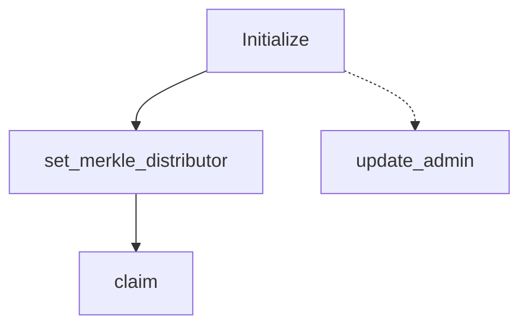

# Rewards Distributor

This document provides detailed instructions on how to use the various functionalities of the Rewards program.

## Address

**HUQgMMSpb47bbDfavp27CZ78cJyYfCWR3i1GG4KbBB4m**

## Project Purpose

The purpose of the Rewards Distributor is to enable users to claim rewards after participating in a two-week epoch. This system ensures that participants are rewarded fairly and efficiently based on their contributions during the epoch.

## Project Features

- **Initialization**: Sets up the admin and prepares the rewards program.
- **Admin Update**: Allows the current admin to transfer admin rights to a new admin.
- **Merkle Distributor Setup**: Configures the reward distribution system using a Merkle tree.
- **Reward Claiming**: Enables users to claim their rewards based on the Merkle tree distribution.

## Project Business Logic

The rewards distributor uses Merkle trees submitted by the admin to determine the amount of funds each user can claim. The process involves initializing the contract, setting up the Merkle distributor, and allowing users to claim their rewards based on their proof of participation.

## Instructions

The Rewards program includes several key instructions to manage and claim rewards. Below are the details:

### 1. Initialize

The `initialize` instruction serves as the constructor for the program. It sets the admin and prepares the program for use.

Parameters:
- `ctx`: The context for the instruction.

### 2. Update Admin

The `update_admin` instruction allows the current admin to assign a new admin. This instruction can only be executed by the existing admin.

Parameters:
- `ctx`: The context for the instruction.
- `new_admin`: The address (Pubkey) of the new admin to be set.

### 3. Set Merkle Distributor

The `set_merkle_distributor` instruction configures the Merkle distributor. This distributor manages the distribution of rewards based on a Merkle tree. This instruction is restricted to admin use only.

Parameters:

- `ctx`: The context for the instruction.
- `bump`: A bump seed for the PDA.
- `root`: The root of the Merkle tree used for rewards distribution.
- `max_total_claim`: The maximum total amount that can be claimed.
- `max_num_nodes`: The maximum number of nodes in the Merkle tree.

### 4. Claim

The `claim` instruction enables users to claim their rewards. Users can call this function to receive their rewards based on the Merkle tree distribution.

Parameters:
- `ctx`: The context for the instruction.
- `_bump`: A bump seed for the PDA.
- `index`: The index of the claim.
- `amount`: The amount of reward to be claimed.
- `proof`: The Merkle proof for the claim, a vector of 32-byte arrays.

## Workflow
The following steps outline the typical workflow for using the Rewards program:

1. Initialization
    - The admin initializes the program using the `initialize` instruction with their address.

2. Setting Up the Merkle Distributor
    - The admin sets up the Merkle distributor using the `set_merkle_distributor` instruction with the necessary parameters.

3. Updating Admin (if necessary)
    - If the admin needs to change, the current admin uses the `update_admin` instruction to assign a new admin.

4. Claiming Rewards
    - Users claim their rewards by calling the `claim` instruction with the necessary proof and amount.

## Rewards Program Workflow Diagram

