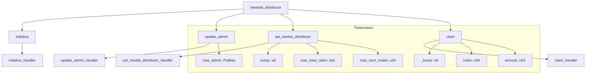

```mermaid
graph TD
    A[rewards_distributor] --> B[initialize]
    A --> C[update_admin]
    A --> D[set_merkle_distributor]
    A --> E[claim]

    B --> F[initialize_handler]
    C --> G[update_admin_handler]
    D --> H[set_merkle_distributor_handler]
    E --> I[claim_handler]

    subgraph Parameters
        C --> J[new_admin: Pubkey]
        D --> K[bump: u8]
%%        D --> L[root: u8\[32\]]
        D --> M[max_total_claim: u64]
        D --> N[max_num_nodes: u64]
        E --> O[_bump: u8]
        E --> P[index: u64]
        E --> Q[amount: u64]
%%        E --> R[proof: Vec\<u8\[32\]\>]
    end
```
