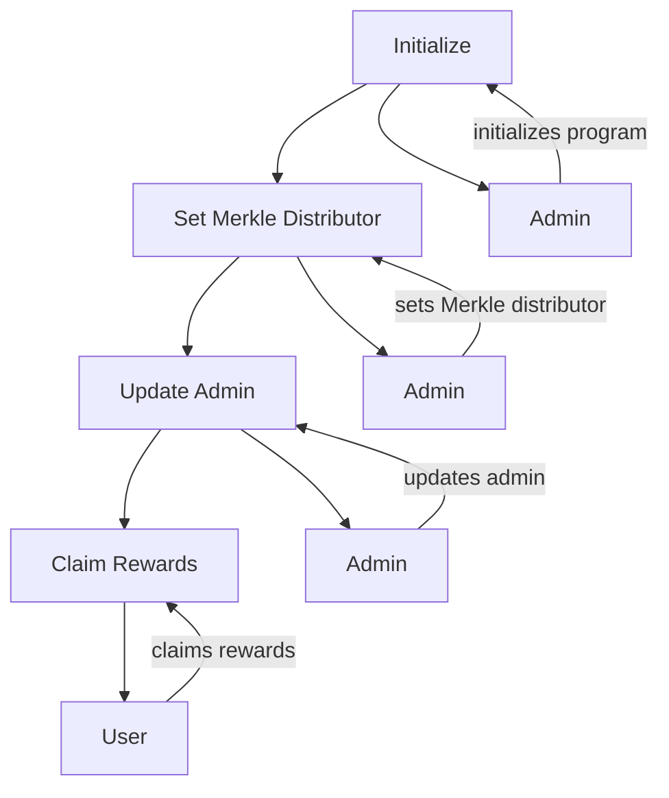
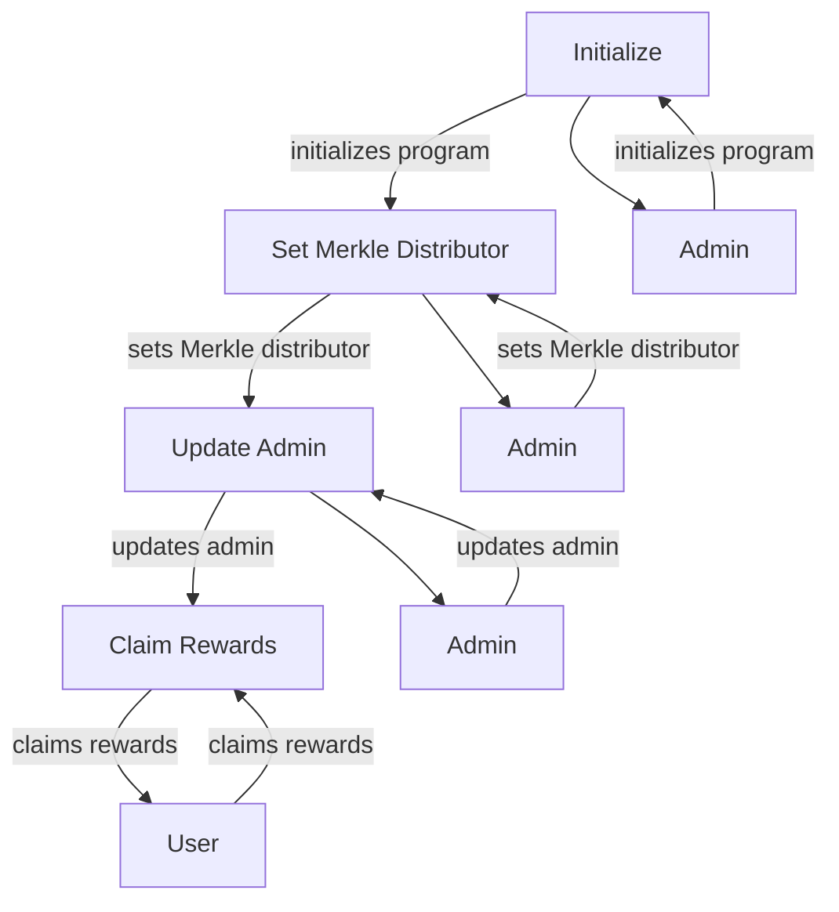

# Rewards Program Workflow Diagram

```mermaid
graph TD
    A[Initialize] --> B[Set Merkle Distributor]
    B --> C[Update Admin]
    C --> D[Claim Rewards]
    A --> E[Admin]
    B --> F[Admin]
    C --> G[Admin]
    D --> H[User]
    E -->|initializes program| A
    F -->|sets Merkle distributor| B
    G -->|updates admin| C
    H -->|claims rewards| D
```

```mermaid
graph TD
    A[Initialize] --> |initializes program| B[Set Merkle Distributor]
    B --> |sets Merkle distributor| C[Update Admin]
    C --> |updates admin| D[Claim Rewards]
    D --> |claims rewards| H[User]

    A --> E[Admin]
    B --> F[Admin]
    C --> G[Admin]

    E -->|initializes program| A
    F -->|sets Merkle distributor| B
    G -->|updates admin| C
    H -->|claims rewards| D
```
