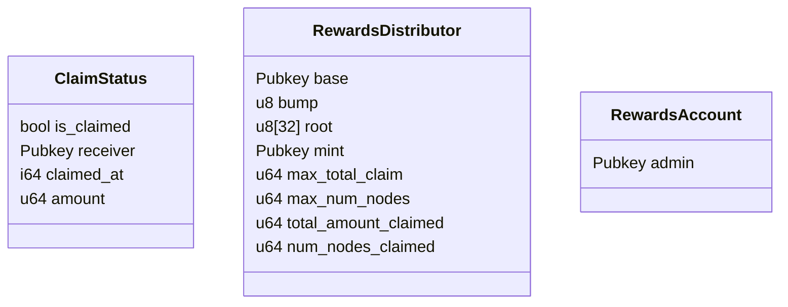

```mermaid
classDiagram
    class ClaimStatus {
        bool is_claimed
        Pubkey receiver
        i64 claimed_at
        u64 amount
    }

    class RewardsDistributor {
        Pubkey base
        u8 bump
        u8[32] root
        Pubkey mint
        u64 max_total_claim
        u64 max_num_nodes
        u64 total_amount_claimed
        u64 num_nodes_claimed
    }

    class RewardsAccount {
        Pubkey admin
    }
```
